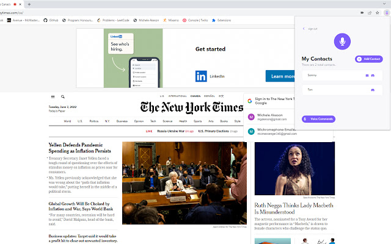

# MICHROMEPHONE
[chrome-link](https://chrome.google.com/webstore/detail/michromephone/ilcdkmgajobpoeemenhnncagcjemnaco)

### About
Michromephone is a little personal project that allows users to send discord messages and emails to friends from the chrome browser by using simple voice commands. We've also added additional voice commands to allow a user to:
- copy text from a webpage 
- read text out loud from a webpage
- send a link of the current tab
- stores spoken commands into a users clipboard which can be sent in messages

